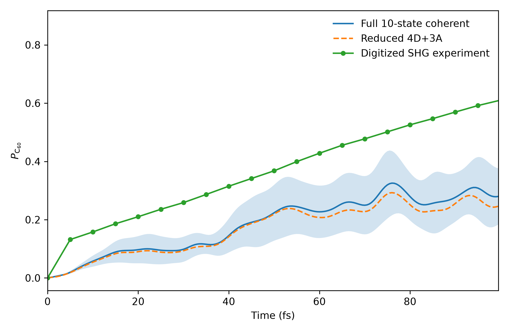
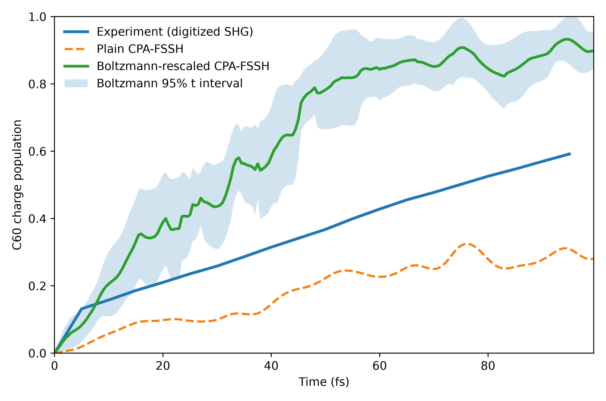
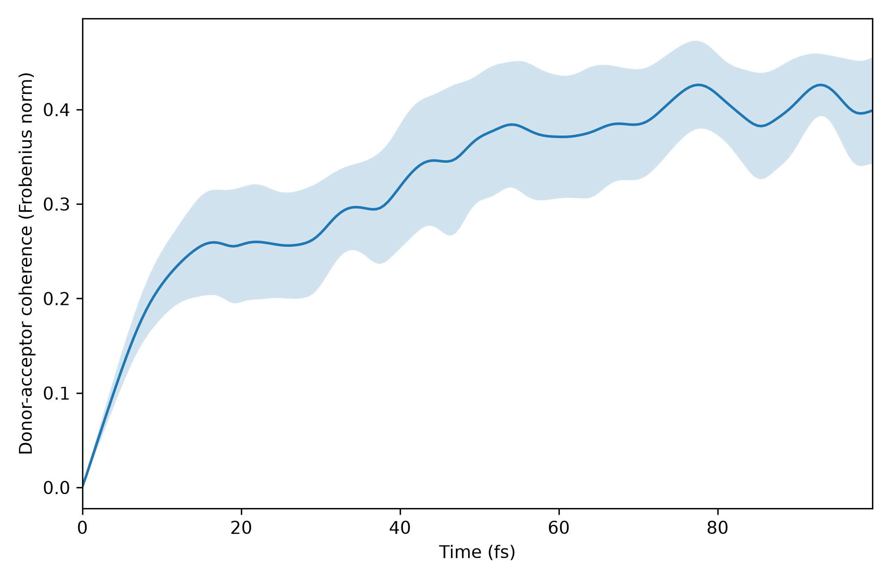
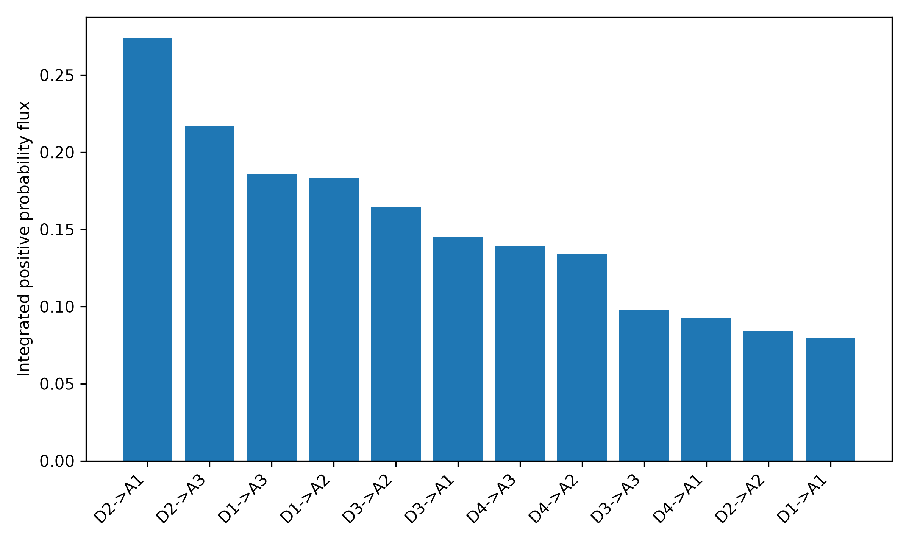

# ab-initio charge-transfer dynamics in 2H2Pc/C60

**Amirhosein (Amir) Amini**  
Department of Chemistry, Texas A&M University  
Advisor: Prof. Arkajit Mandal  
CyberTraining Summer School 2026

## Main Structure of The Project

In this work, I develop an ab-initio workflow for early-time photoinduced charge-transfer dynamics in a 176-atom free-base phthalocyanine dimer–fullerene complex, `2H2Pc/C60`. The reference system was introduced by Yamijala and Huo, who modeled the dynamics with a DFTB-based nonadiabatic Hamiltonian. Here, the molecular trajectories and electronic Hamiltonians are instead generated with PySCF.

Ten independent 100 fs Born–Oppenheimer molecular-dynamics trajectories are used to sample nuclear motion at 300 K. At every 0.5 fs frame, we calculate the first ten unoccupied Kohn–Sham orbitals, construct a C60 fragment projector, track the active orbital manifold across geometries, and obtain orbital time-derivative couplings from the matrix logarithm of the closest-unitary overlap. The resulting trajectory-dependent ten-state Hamiltonians are propagated in two ways: numerically exact matrix-exponential propagation within the finite active space and classical-path fewest-switches surface hopping with Libra.

An independently constructed four-donor plus three-acceptor (`4D+3A`) Hamiltonian reproduces the full coherent ensemble with an RMSE of `0.01830`. Plain classical-path FSSH underestimates the digitized experimental transfer, while a Boltzmann-rescaled uphill-hop prescription overestimates it. The donor–acceptor density matrix retains substantial coherence, and pair-resolved probability currents reveal strong recrossing: the most dynamically active donor–acceptor pair is not the largest source of net acceptor accumulation. The principal uncertainty is therefore physical-model sensitivity—especially the electronic Hamiltonian, prescribed nuclear paths, and detailed-balance treatment—rather than numerical instability in orbital tracking or propagation.

## System

The neutral complex contains:

| Property | Value |
|---|---:|
| Molecular formula | `C124H36N16` |
| Total atoms | `176` |
| Total electrons | `892` |
| Donor fragment | atoms `1–116`, two H2Pc molecules |
| Acceptor fragment | atoms `117–176`, C60 |

The published starting structure is stored in `data/2H2Pc_C60.xyz`, and the fragment definition is stored in `data/fragments.json`. The initial frontier-orbital analysis and PySCF/geomeTRIC relaxation code are retained under `src/`. The exact coordinates used to launch the ten production trajectories are stored under `data/production_starts/`, so the production ensemble can be reproduced without the need to run a thermalization run.

## Computational workflow

```text
published 2H2Pc/C60 geometry
        |
        v
geometry validation + frontier-orbital analysis + PySCF relaxation
        |
        v
10 independent 100 fs PySCF AIMD trajectories at 300 K
        |
        v
2,000 electronic snapshots: energies, orbitals, and C60 projectors
        |
        v
cross-geometry assignment + phase correction + polar decomposition
        |
        v
matrix-log orbital derivative couplings and 10-state H_vib(t)
        |
        +-------------------------------+
        |                               |
        v                               v
exact finite-space coherent         Libra CPA-FSSH
propagation                         plain / Boltzmann
        |
        v
independent 4D+3A reduced Hamiltonian
        |
        v
coherence and donor-to-acceptor probability-current analysis
```

## Methods

### 1. Geometry preparation and AIMD

The published geometry is first checked for atom count, composition, and fragment ordering. The retained preparation scripts perform a static frontier-orbital calculation and a PySCF/geomeTRIC relaxation before molecular dynamics.

The production nuclear trajectories use:

| Setting | Value |
|---|---:|
| Electronic structure | PBE-D3(BJ)/6-31G |
| Integral treatment | density fitting |
| Temperature | `300 K` |
| Thermostat | Berendsen |
| Nuclear time step | `0.5 fs` |
| Frames per trajectory | `200` |
| Nominal trajectory length | `100 fs` |
| Independent trajectories | `10` |
| Total electronic snapshots | `2,000` |

These are ground-state Born–Oppenheimer trajectories. They provide prescribed fluctuating nuclear paths for the subsequent electronic dynamics; the propagated electronic state does not exert back-reaction on the nuclei.

### 2. Electronic active space and initial state

At each geometry, the electronic active space consists of the first ten unoccupied Kohn–Sham orbitals. For the snapshot electronic calculations, the D3 correction is omitted because it changes the nuclear potential and forces but not the Kohn–Sham orbital coefficients used in the electronic propagation.

The initial electronic state is the isolated donor-dimer LUMO projected into the full-complex active space. If `phi_D` is the isolated donor LUMO and `psi_i` are the ten active complex orbitals,

```math
b_i = \langle \psi_i | \phi_D \rangle,
\qquad
c_i(0)=\frac{b_i}{\sqrt{\sum_j |b_j|^2}}.
```

This avoids initializing the dynamics in whichever adiabatic orbital happens to carry the largest donor weight at one geometry. Instead, the initial wavefunction is tied to a physically defined donor-localized orbital.

### 3. C60 fragment population

A symmetrized Mulliken projector is constructed for the C60 atomic-orbital block and transformed into the ten-state active basis. The coherent C60 population is

```math
P_{\mathrm{C60}}(t)=\mathbf{c}^{\dagger}(t)
\mathbf{P}_{\mathrm{C60}}(t)\mathbf{c}(t).
```

Because the fragment projector contains off-diagonal elements, this observable includes interference between active orbitals. A simple sum of adiabatic-state populations weighted by diagonal C60 character would generally omit that coherence contribution.

### 4. Orbital tracking and derivative couplings

Directly sorting orbitals by energy is unreliable near avoided crossings and within nearly degenerate C60 manifolds. For adjacent geometries, we therefore compute the cross-geometry overlap

```math
O_{ij}^{(n)}=
\left\langle\psi_i(\mathbf{R}_n)\middle|
\psi_j(\mathbf{R}_{n+1})\right\rangle.
```

The tracking procedure is:

1. use the Hungarian algorithm to maximize the total absolute orbital overlap;
2. correct orbital signs so matched diagonal overlaps are positive;
3. calculate the closest-unitary polar factor `U` of the tracked overlap;
4. obtain the midpoint orbital derivative-coupling matrix from the matrix logarithm.

If `O = L Sigma R†`, the closest unitary matrix is `U = L R†`, and

```math
\mathbf{D}_{n+1/2}=\frac{1}{\Delta t}\log\mathbf{U}_n,
\qquad
\mathbf{H}_{\mathrm{vib},n+1/2}
=\mathbf{E}_{n+1/2}-i\mathbf{D}_{n+1/2}.
```

I should note that these are **Kohn–Sham orbital time-derivative couplings**.

### 5. Coherent propagation

For each piecewise-constant midpoint Hamiltonian, the electronic coefficients are propagated as

```math
\mathbf{c}(t+\Delta t)=
\exp[-i\mathbf{H}_{\mathrm{vib}}\Delta t]\mathbf{c}(t).
```

The matrix exponential is numerically exact for each interval within the specified finite ten-state Hamiltonian. Therefore, “Exact coherent dynamics” does **not** mean exact many-electron molecular dynamics.

### 6. Libra classical-path FSSH

Libra evaluates fewest-switches hopping probabilities while the PySCF nuclear trajectory remains fixed. For each of the ten nuclear paths, `20,000` stochastic surface histories are propagated with `200` electronic substeps per 0.5 fs nuclear interval.

Two hopping methods are compared:

- **Plain CPA-FSSH:** the unmodified classical-path hopping probabilities;
- **Boltzmann-rescaled CPA-FSSH:** uphill hops from state `i` to state `j` are multiplied by

```math
\exp\left[-\frac{E_j-E_i}{k_{\mathrm B}T}\right],
\qquad E_j>E_i.
```

The coherent amplitudes and Hamiltonians are identical in these two calculations. Only the stochastic active-surface histories change. This makes the comparison a direct test of detailed-balance sensitivity rather than a comparison of two unrelated electronic models.

### 7. Fragment-adapted reduced Hamiltonian

The ten-state active space contains four donor-like and six acceptor-like directions. The reduced model retains:

- the complete four-state donor subspace;
- the three lowest-energy C60 states.

Both fragment subspaces are parallel transported between frames, and a new seven-state Hamiltonian is constructed independently using the same overlap, polar-decomposition, and matrix-log procedure.

The reduced model is tested against the full coherent propagation over every trajectory and every time point. Its purpose is to determine whether a compact mechanistic Hamiltonian preserves the observable of interest before using it for pathway analysis.

### 8. Coherence and probability currents

For donor state `d` and acceptor state `a`, the instantaneous coherent probability current is

```math
J_{d\rightarrow a}(t)=
2\,\mathrm{Im}\left[
H_{ad}(t)c_d(t)c_a^*(t)
\right].
```

Three integrated quantities are used:

- the **signed integral**, which measures net population transferred through the pair;
- the **positive integral**, which measures total forward activity;
- the **absolute integral**, which measures total bidirectional exchange.

A channel can therefore be highly active while contributing little net charge transfer if the population repeatedly moves forward and backward.

## Results and interpretation

### Summary

| Result | Value | Interpretation |
|---|---:|---|
| Minimum consecutive-overlap singular value | `0.999580` | The ten-state active subspace remains continuous across all adjacent geometries. |
| Full coherent C60 population at 99.5 fs | `0.2798 ± 0.0963` | Baseline coherent prediction; uncertainty is the 95% confidence interval across ten nuclear paths. |
| Reduced 4D+3A C60 population at 99.5 fs | `0.2462 ± 0.0882` | Compact model gives nearly the same ensemble behavior. |
| Full-versus-reduced ensemble RMSE | `0.01830` | Reduction error is small over the complete time window, not only at the endpoint. |
| Plain CPA-FSSH endpoint | `0.28085` | Substantially below the digitized experiment. |
| Plain CPA-FSSH full-window RMSE | `0.19221` | Plain hopping under-transfers over most of the simulated interval. |
| Boltzmann-rescaled endpoint | `0.89890` | Substantially above the digitized experiment. |
| Boltzmann full-window RMSE | `0.30455` | Strong suppression of uphill return overcorrects the kinetics. |
| Digitized experimental endpoint | `0.60857` | Approximate value read from the published SHG figure; not original raw data. |
| Maximum mean donor–acceptor coherence | `0.42616` at `77.5 fs` | Donor and acceptor subspaces remain substantially coherently mixed. |
| Most active positive-flux pair | `D2 -> A1`, `0.27390` | Largest forward activity, but not largest net accumulation because of recrossing. |
| Current-continuity RMSE | `6.25 × 10^-5 fs^-1` | Sum of pair currents reproduces the derivative of the acceptor population. |

### 1. Orbital tracking is numerically stable

Across all `2,000` electronic snapshots, the minimum singular value of the consecutive ten-state overlap matrices is `0.999580`. A singular value close to one means that the active space at one frame almost completely spans the same physical orbital manifold at the next frame.

This is important because individual near-degenerate C60 orbitals can rotate substantially or exchange energy order. The high singular values show that those rotations occur **within** a continuous ten-state subspace. Consequently, the final disagreement with experiment cannot reasonably be attributed to the active manifold disappearing or to catastrophic state-tracking failure.

### 2. The 4D+3A model preserves the coherent observable

At `99.5 fs`, the full ten-state coherent ensemble gives

```math
P_{\mathrm{C60}}^{10\mathrm{s}}=0.2798\pm0.0963,
```

while the independently constructed reduced model gives

```math
P_{\mathrm{C60}}^{4D+3A}=0.2462\pm0.0882.
```

The uncertainties are 95% confidence intervals across the ten independent nuclear trajectories. The ensemble-curve RMSE is `0.018301`, and the mean trajectory-level RMSE is `0.025094`. The maximum difference between the full fragment-projector population and the simpler retained-acceptor-subspace population is `0.006402`.



**Interpretation.** The seven-state model reproduces the time-dependent observable throughout the full 99.5 fs interval, not merely at the final time. This supports the use of the `4D+3A` Hamiltonian as a compact mechanistic model. The small but systematic reduction error also shows why validation is necessary: selecting states by donor or acceptor character alone is not automatically guaranteed to preserve coherent interference.

The experimental curve lies well above both coherent calculations. Since the reduced and full calculations agree closely, this discrepancy is not caused by the active-space reduction.

### 3. The experiment lies between two FSSH detailed-balance limits

The approximate digitized experimental endpoint is `0.608567`. Plain CPA-FSSH gives `0.280850`, with a full-window RMSE of `0.192214`. Boltzmann-rescaled CPA-FSSH gives `0.898903`, with an RMSE of `0.304553`.



**Interpretation.** In the plain calculation, uphill return from lower C60-like states remains comparatively accessible, so acceptor population does not accumulate rapidly enough. Multiplying thermally uphill hops by a Boltzmann factor strongly suppresses that return and drives excessive acceptor accumulation. The experimental curve lies between these limits.

The Boltzmann prescription is therefore not a universal “correction” that automatically improves FSSH. In this system, it changes the answer more than the statistical uncertainty across nuclear trajectories and even changes the direction of the error relative to experiment. The detailed-balance rule is one of the dominant physical-model choices in the calculation.

### 4. Charge transfer retains substantial donor–acceptor coherence

The mean Frobenius norm of the donor–acceptor density-matrix block reaches `0.426162` at `77.5 fs`.



**Interpretation.** The donor and acceptor subspaces are not behaving as two classical boxes connected only by irreversible hops. Their amplitudes remain coherently mixed over a significant portion of the simulation. This does not imply that environmental decoherence is absent in the real experiment; rather, it shows that the present finite-space Hamiltonian naturally generates coherent exchange and that a purely population-only interpretation discards relevant information.

### 5. The most active channel is dominated by recrossing

The largest positive integrated flux is the `D2 -> A1` channel:

| Flux measure for `D2 -> A1` | Value |
|---|---:|
| Positive integral | `0.273903` |
| Signed integral | `0.029675` |
| Absolute integral | `0.518130` |



The positive integral is large because substantial population moves from `D2` toward `A1`. The absolute integral is even larger because it counts both forward and backward exchange. The much smaller signed integral shows that most of this activity is canceled by recrossing.

The largest net-forward channels are:

| Channel | Signed integrated flux |
|---|---:|
| `D1 -> A3` | `0.072861` |
| `D1 -> A2` | `0.053819` |
| `D3 -> A2` | `0.049790` |
| `D2 -> A3` | `0.041704` |

By contrast, `D2 -> A2` has a signed integral of `-0.036544`, indicating net backflow through that pair.

**Interpretation.** “Dominant pathway” depends on the quantity being ranked. `D2 -> A1` is the most dynamically active exchange channel, but `D1 -> A3` contributes more net forward accumulation. A mechanism inferred only from instantaneous couplings, maximum populations, or positive flux would miss this distinction.

Summing all twelve pair currents reproduces the time derivative of the acceptor population with a mean RMSE of `6.25 × 10^-5 fs^-1`, providing an internal continuity check on the pathway decomposition. The complete signed, positive, and absolute current table is stored in `results/donor_acceptor_channel_flux.csv`.


## Repository layout

| Path | Contents |
|---|---|
| `data/` | Published geometry, fragment map, exact production starts, and digitized experiment |
| `src/` | All retained Python and Slurm source code in execution order |
| `docs/` | Additional method, reproducibility, and interpretation notes |
| `results/` | Compact machine-readable metrics, channel currents, and original figures |
| `report/` | Supplementary LaTeX report and compiled PDF |
| `environment-pyscf.yml` | Reproducible lightweight PySCF-side environment |
| `Makefile` | Geometry validation and Python compilation checks |

Large AIMD trajectories, checkpoint files, and the 2,000 frame-level orbital archives are intentionally not tracked because they are multi-gigabyte intermediates. The exact starting coordinates, deterministic random-seed rules, source code, and Slurm templates needed to regenerate them are retained.

## Source-code inventory

| Program | Purpose |
|---|---|
| `src/00_validate_geometry.py` | Validate formula, atom count, fragment ordering, and closest contacts |
| `src/01_frontier_analysis.py` | Static frontier orbitals and isolated-donor-LUMO projection |
| `src/02_relax_geometry.py` | Initial PySCF/geomeTRIC relaxation |
| `src/03_prepare_replicas.py` | Recreate the ten production starts from a source thermalization trajectory |
| `src/04_run_aimd.py` | PySCF Born–Oppenheimer AIMD |
| `src/05_extract_electronic.py` | Ten-state energies, orbital coefficients, projectors, and initial state |
| `src/06_track_states.py` | Orbital assignment, phase tracking, polar overlaps, and derivative couplings |
| `src/07_run_fssh.py` | Libra classical-path FSSH propagation |
| `src/08_analyze_fssh.py` | Aggregate FSSH trajectories and uncertainties |
| `src/09_build_reduced_model.py` | Construct and validate the `4D+3A` Hamiltonian |
| `src/10_plot_libra_experiment.py` | Generate Libra estimator and experiment-comparison figures |
| `src/11_compare_fssh_variants.py` | Compare plain and Boltzmann-rescaled FSSH |
| `src/12_analyze_coherent_mechanism.py` | Coherent dynamics, coherence, and pair-current analysis |
| `src/slurm/` | Portable HPC submission templates |

## Reproduction

All commands below are run from the repository root.

### 1. Clone and validate

```bash
git clone https://github.com/amiraminitamu/Summer-School-Buffalo.git
cd Summer-School-Buffalo
git switch submission-ready

conda env create -f environment-pyscf.yml
conda activate pc60-pyscf
make check
```

### 2. Initial structure and orbital calculations

```bash
python src/00_validate_geometry.py
sbatch src/slurm/00_initialization.slurm
```

The initialization launcher performs the static donor-LUMO projection and the PySCF/geomeTRIC relaxation. The exact structures used for production are already stored under `data/production_starts/`.

To repeat their extraction from the corresponding thermalization trajectory:

```bash
python src/03_prepare_replicas.py \
  --trajectory output_thermalization/aimd.md.xyz
```

### 3. Production AIMD and electronic Hamiltonians

```bash
sbatch src/slurm/01_aimd_array.slurm
sbatch src/slurm/02_electronic_array.slurm
sbatch src/slurm/03_tracking_array.slurm
```

### 4. Libra CPA-FSSH

```bash
sbatch src/slurm/04_libra_array.slurm

BOLTZMANN=1 OUTROOT=output_libra/fssh_boltzmann \
  sbatch src/slurm/04_libra_array.slurm
```

### 5. Analysis

```bash
python src/08_analyze_fssh.py \
  --root output_libra/fssh --ntraj 10

python src/09_build_reduced_model.py \
  --root output_tracked --ntraj 10

python src/10_plot_libra_experiment.py \
  --libra-root output_libra/fssh \
  --tracked-root output_tracked \
  --experiment data/experiment_shg_digitized.csv \
  --outdir output_libra/final_figures \
  --ntraj 10

python src/11_compare_fssh_variants.py \
  --plain-root output_libra/fssh \
  --boltzmann-root output_libra/fssh_boltzmann \
  --tracked-root output_tracked \
  --experiment data/experiment_shg_digitized.csv \
  --outdir output_libra/final_figures_boltzmann \
  --ntraj 10

python src/12_analyze_coherent_mechanism.py \
  --root output_reduced_4d3a \
  --ntraj 10 \
  --experiment data/experiment_shg_digitized.csv \
  --outdir output_coherent_mechanism
```

The PySCF and Libra calculations use separate environments. Set `PYSCF_PYTHON` and `LIBRA_PYTHON` before submitting the portable Slurm launchers, or replace those variables with the module/Conda activation commands appropriate for the target cluster.

## Machine-readable results

The main numerical conclusions can be inspected without rerunning the large calculations:

- `results/current_results.json`: headline metrics;
- `results/fssh_summary.csv`: plain FSSH, Boltzmann-rescaled FSSH, and experiment comparison;
- `results/coherent_summary.json`: full and reduced coherent dynamics;
- `results/donor_acceptor_channel_flux.csv`: signed, positive, and absolute pair currents;
- `results/figures/`: original PDF and PNG figures produced by the analysis scripts.


## References

1. S. R. K. C. Yamijala and P. Huo, “Direct Nonadiabatic Simulations of the Photoinduced Charge Transfer Dynamics,” *J. Phys. Chem. A* **125**, 628–635 (2021), DOI: [10.1021/acs.jpca.0c10151](https://doi.org/10.1021/acs.jpca.0c10151).
2. Q. Sun *et al.*, “PySCF: the Python-based simulations of chemistry framework,” *WIREs Comput. Mol. Sci.* **8**, e1340 (2018).
3. A. V. Akimov, “Libra: An open-source methodology-discovery library for quantum and classical dynamics simulations,” *J. Comput. Chem.* **37**, 1626–1649 (2016).
4. J. C. Tully, “Molecular dynamics with electronic transitions,” *J. Chem. Phys.* **93**, 1061–1071 (1990).

