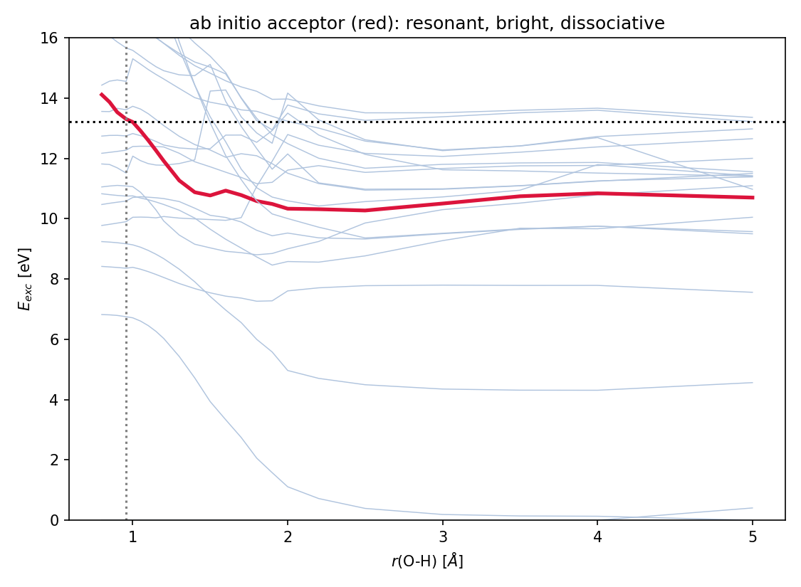
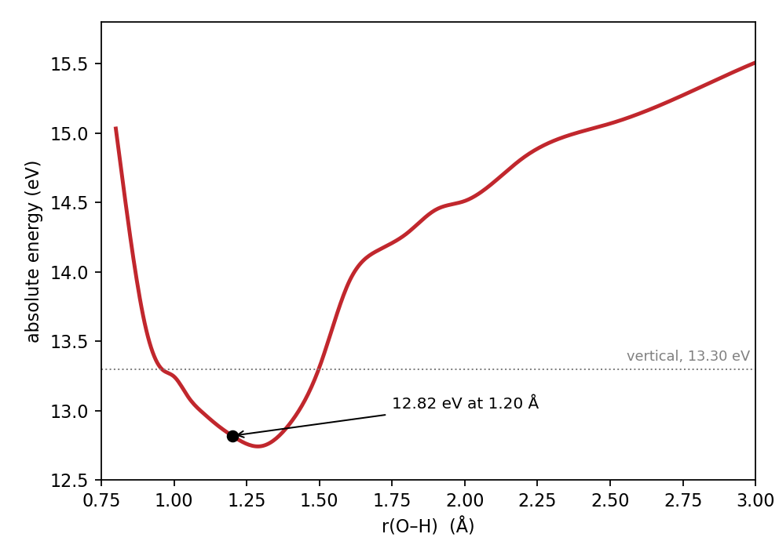
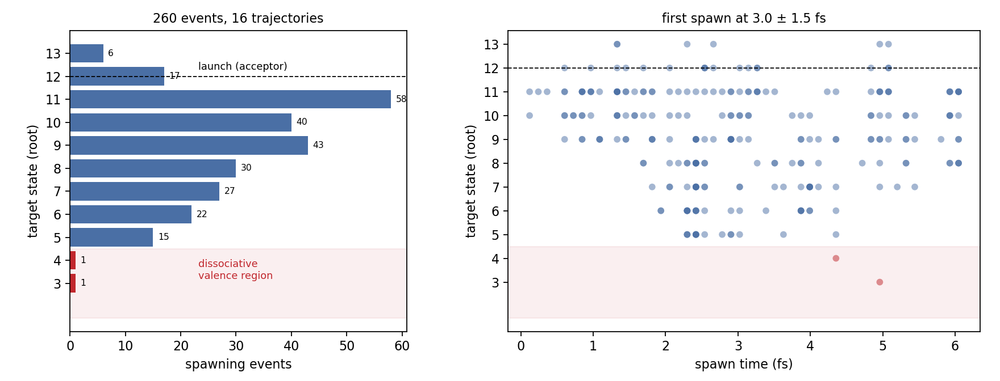
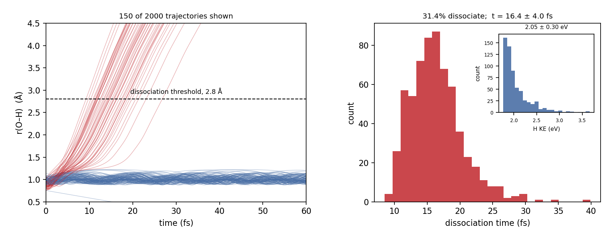

# Virtual Photon Dissociation in Ar·H₂O: a bound acceptor and a nonadiabatic cascade

Owen Holtfrank · Georgia Institute of Technology (Kretchmer group) · CyberTraining 2026

---

Anomalous H⁺(H₂O)ₙ yields from water films on argon, observed by Grieves and
Orlando with a threshold near the Ar 3s ionization energy, were attributed to
interatomic Coulombic decay (ICD). This work shows ab initio that in the Ar·H₂O
dimer ICD is closed — Coulomb repulsion places the two-hole final state 3.5 eV
out of reach — leaving virtual photon dissociation (VPD) as the only open
channel. The accepting state is bound rather than dissociative, so fragmentation
cannot proceed by the single step the standard rate expression assumes.

📄 **[Full report (PDF)](oholtfrank3_document.pdf)**

| quantity | value |
|---|---|
| Ar 3s⁻¹ vertical (XMS-CASPT2) | 28.97 eV (expt 29.24) |
| ICD threshold at 3.5 Å | 32.49 eV → **closed** |
| VPD acceptor | 13.30 eV, f = 0.157 |
| transfer coupling (two routes) | 12.37 / 9.35 meV (30% agreement) |
| transfer lifetime | 1.2 ps at 3.5 Å |
| acceptor dissociation | **0.1%** — bound |
| dissociative states in manifold | only Ã, 6.6 eV below the acceptor |
| AIMS cascade | 260 spawns, first at 3.0 fs; reaches root 3, not Ã, in 48 fs |
| Ã fragmentation (if reached) | 31.4%, 16.4 fs, H at 2.05 eV |

---

## The result in four steps

**1. ICD is closed; VPD is the only open channel.** The Ar 3s hole carries
28.97 eV. ICD requires a two-hole, two-site final state whose energy includes
the Coulomb repulsion between the resulting charges, placing its threshold at
32.49 eV — 3.5 eV out of reach. VPD, which leaves both fragments neutral, is
open.

**2. The accepting state is identified.** One state — root 12 at 13.30 eV,
f = 0.157 — is simultaneously resonant with the Ar 3s→3p gap (13.21 eV) and
dipole-bright. Its excitation energy falls 2.6 eV along O–H, suggesting
dissociative character.



**3. The acceptor is bound — the central finding.** The excitation energy falls,
but the *absolute* energy — what the nuclei feel — has a minimum at 1.20 Å and
rises thereafter, because the ground-state Morse potential rises 5.1 eV while
the excitation energy falls only 2.6 eV. Classical propagation of 2000
trajectories gives 0.1% dissociation. Of fourteen states characterized, only Ã
(6.6 eV below the acceptor) is dissociative along this coordinate.



**4. The cascade is fast but exit-less.** Ab initio multiple spawning shows the
acceptor decaying within 3 fs, funnelling monotonically down the manifold — 260
spawning events, only 6 upward. But the states reached are themselves bound, and
within the 48 fs window the cascade does not reach Ã.



The à channel, if populated, fragments in 16.4 fs with the H atom carrying
2.05 eV; whether the cascade reaches it is beyond the propagated window.



---

## Why it matters

Cederbaum's rate expression for VPD evaluates the acceptor's response through a
photodissociation cross-section defined for a dissociative continuum final
state. In Ar·H₂O no such state exists at the resonance energy — the acceptor and
the manifold down to à are bound. The transfer physics the expression describes
is sound (the two coupling routes agree to 30%, and the golden-rule form
reproduces Cederbaum's N₂ benchmark), but the single-step fragmentation it
presumes cannot proceed in this system.

---

## Repository

```
project/
├── 01_electronic_structure/    donor energy, channel arithmetic
├── 02_acceptor_identification/ SA(20)-CASSCF + RASSI scan → acceptor
├── 03_surfaces/                1D and 2D scans; tracked Ã/B̃ surfaces
├── 04_rates_and_coupling/      dipole–dipole and golden-rule coupling
├── 05_aims/                    AIMS cascade (PySpawn) — 260 spawns
├── 06_fragmentation/           classical propagation: 0.1% (acceptor), 31.4% (Ã)
├── 07_caspt2_validation/       XMS-CASPT2 ladder — surfaces validated
└── patches/                    the PySpawn get_overlap fix (>10 states)
```

Figures are in [`../figures/`](../figures/). Raw AIMS trajectories (~295 MB) are
archived separately; `05_aims/results/cascade_stats.txt` holds the extracted
statistics.

---

## Reproducibility

All calculations were run on the UB CCR cluster. Paths in the scripts are
specific to that environment and must be adjusted to reproduce elsewhere.

**Software**
- OpenMolcas (SA-CASSCF, XMS-CASPT2, RASSI) — electronic structure and surfaces
- PySpawn — AIMS dynamics; requires the patch in `patches/` to run beyond 10
  singlet states
- Libra — NE-FGR (documented negative)
- Python 3 with NumPy, SciPy, matplotlib — classical propagation and analysis

**Environment**
```bash
# PySpawn (python 2.7)
source /projects/academic/cyberwksp21/SOFTWARE_2026/miniforge3/etc/profile.d/conda.sh
conda activate $HOME/pyspawn

# analysis + classical propagation (python 3)
/projects/academic/cyberwksp21/SOFTWARE/Conda/envs/libra/bin/python3

# OpenMolcas
export MOLCAS=/projects/academic/cyberwksp21/SOFTWARE_2026/OpenMolcas
```

**SLURM** (ub-hpc): `--cluster=ub-hpc --partition=general-compute
--qos=general-compute --account=cyberwksp21`, 12 cores, ~4 min per AIMS step.

**Workflow**
1. `02_acceptor_identification/` — run `m2_*.in`, then `extract_acceptor.py` →
   `acceptor_curve.npz`
2. `03_surfaces/` — run `mono_*.in` and `m3_*.in`, then `track2.py` /
   `extract_2d.py` → `tracked_states.npz`, `surf2d.npz`
3. `06_fragmentation/` — `frag_classical.py` (acceptor, 0.1%) and
   `frag_lower.py` (Ã, 31.4%)
4. `05_aims/` — launch from `template/` (patched PySpawn); `cascade_stats.py`
   extracts the spawn statistics
5. `07_caspt2_validation/` — run `pt2_*.in` → `pt2_ladder.txt`

Figures regenerate from the committed `.npz` files without the raw `.out` data.
